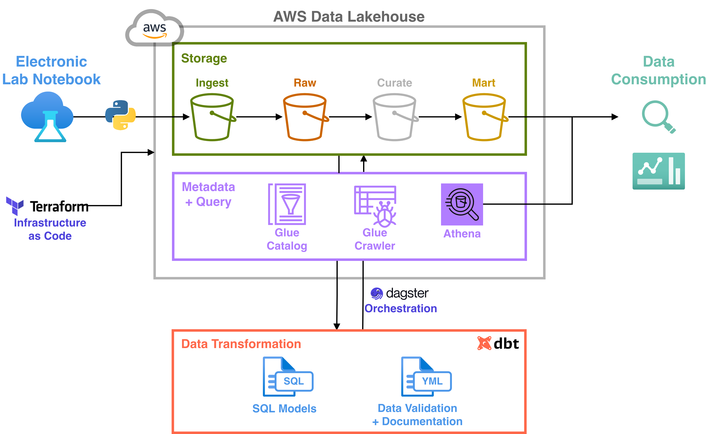

# Oncology Experimental Lakehouse

A modern cloud-native oncology R&D data platform built on AWS using a lakehouse architecture. The project demonstrates scalable ingestion, orchestration, transformation, governance, and analytics patterns delivering robust data management and data-driven value enablement.

The platform simulates experimental and operational workflows for immunotherapy and antibody discovery programs using synthetic ELN-style datasets.

---

## Project Objectives

This project was designed to demonstrate practical implementation of:

* Cloud-native lakehouse architecture on AWS
* Event-driven data ingestion pipelines
* Incremental ELT modeling using dbt
* Scientific/R&D data modeling concepts
* Orchestration using Dagster
* Infrastructure-as-Code using Terraform
* Queryable analytics using Athena + Iceberg
* Portfolio-quality data engineering and data architecture practices

The implementation leverages synthetically generated ELN-style data to simulate an oncology R&D platform

---

# Architecture Diagram




# Architecture Overview

```text
Synthetic ELN Data
        │
        ▼
S3 Ingest Layer
(raw JSON landing zone)
        │
        ▼
Dagster Sensor
(event detection)
        │
        ▼
Python Ingestion Pipelines
        │
        ▼
Raw Layer (Parquet)
AWS Glue Catalog Registration
        │
        ▼
dbt Transformations
(src → dim/fct → marts)
        │
        ▼
Curate and Mart Layer (Parquet + Iceberg)
AWS Glue Catalog Registration
        │
        ▼
Athena Query Engine
        │
        ▼
Analytics / BI / AI Consumption
```

---

# Technology Stack

| Category               | Technology           |
| ---------------------- | -------------------- |
| Cloud Platform         | AWS                  |
| Object Storage         | Amazon S3            |
| Metadata Catalog       | AWS Glue Catalog     |
| Query Engine           | Amazon Athena        |
| Table Format           | Apache Iceberg       |
| Transformations        | dbt                  |
| Orchestration          | Dagster              |
| Infrastructure-as-Code | Terraform            |
| Programming Language   | Python               |
| Visualization          | TBD                  |

---

# Key Features

## Event-Driven Ingestion

Dagster sensors monitor S3 ingest paths for newly landed files and trigger ingestion jobs automatically.

Features include:

* File-based idempotency
* Incremental ingestion
* Metadata tracking
* Partition-aware loading
* Retry-safe orchestration

---

## Lakehouse Architecture

The platform follows a medallion-style architecture:

| Layer              | Purpose                            |
| ------------------ | ---------------------------------- |
| Ingest             | Raw landed source files            |
| Raw                | Canonical persisted source records |
| Source (`src`)     | Normalized source abstractions     |
| Dimensions (`dim`) | Authoritative business entities    |
| Facts (`fct`)      | Measurable experimental events     |
| Marts              | Analytics-ready business datasets  |

---

## Iceberg Integration

Apache Iceberg is used to provide:

* ACID-like table reliability
* Schema and partition evolution
* Improved metadata handling
* Better scalability for Athena
* Reliable merge/upsert behavior

---

## Synthetic Oncology R&D Data

The project includes synthetic datasets inspired by:

* ELN workflows
* Antibody discovery programs
* Screening assays
* Experimental tracking
* Sample inventory systems

Example entities include:

* Experiments
* Inventory materials (Samples & Stocks)
* Antibody candidates
* Screening results

---

# Example Data Flow

## 1. Landing

Synthetic JSON files are uploaded to:

```text
s3://oncology-experimental-lakehouse/ingest/experiments/
```

---

## 2. Detection

Dagster sensors detect newly landed files and trigger ingestion jobs.

---

## 3. Raw Processing

Python ingestion pipelines:

* Deduplicates data
* Add metadata
* Convert JSON → Parquet
* Write partitioned data to S3

Example metadata fields:

* `source_file_name`
* `source_file_path`
* `ingest_date`

---

## 4. Catalog Registration

AWS Glue Crawlers register datasets into the Glue Catalog for Athena querying.

---

## 5. dbt Transformations

dbt transforms raw datasets into:

* Source models
* Dimensions
* Fact tables
* Analytics marts

Example models:

* `dim_antibody_candidates`
* `fct_screening_results`
* `mart_antibody_candidate_summary`

---

# Example Mart

## Antibody Candidate Summary Mart

This mart aggregates:

* Screening performance
* Candidate metadata
* Assay outcomes
* Experimental statistics

Potential use cases:

* Lead candidate prioritization
* Experimental trend analysis
* Portfolio reporting
* R&D operational analytics

---

# Infrastructure Components

## AWS Services

### Amazon S3

Stores:

* Raw ingest files
* Parquet datasets
* Athena query results

### AWS Glue

Provides:

* Metadata catalog
* Crawlers
* Schema discovery

### Amazon Athena

Provides serverless querying over Parquet and Iceberg-backed datasets.

---

# Data Modeling Concepts

The project demonstrates several modern analytics engineering patterns:

## Incremental Loading

Data models are designed to support:

* New records
* Updated records
* Historical tracking

---

## Dimensional Modeling

Examples include:

* Dimension tables for reusable business entities
* Fact tables for measurable assay events
* Analytical marts for reporting use cases

---

## Metadata-Driven Pipelines

Ingestion logic captures operational metadata for:

* Lineage
* Traceability
* Reproducibility
* Debugging

---

# Example Queries

## Query Experimental Results

```sql
SELECT *
FROM fct_screening_results
LIMIT 10;
```

---

## Aggregate Candidate Performance

```sql
SELECT
    candidate_id,
    avg(activity_score) as avg_score
FROM mart_antibody_candidate_summary
GROUP BY candidate_id
ORDER BY avg_score DESC;
```

---

# Future Enhancements

Planned extensions include:

* More mart models to facilitate business aligned analytics
* Experimental and operational dashboards
* Automated dbt testing

---
